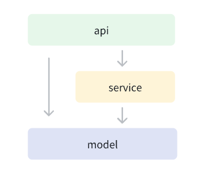

## dog

🐶 一个集成了众多社区优秀组件的 Go Web API 开发模板，简洁、高效、自由

**注意：本项目重在学习交流，目前未经历过大型系统的实战**

## 集成组件

- web引擎：[gin](https://github.com/gin-gonic/gin)
- ORM：[gorm](https://github.com/go-gorm/gorm)
- 配置：[viper](https://github.com/spf13/viper)
- 日志：[zap](https://github.com/uber-go/zap/blob/master)
- 参数校验：[validator](https://github.com/go-playground/validator)
- API文档：[gin-swagger](https://github.com/swaggo/gin-swagger)
- 热重载：[air](https://github.com/cosmtrek/air)
- 工具包：[gox](https://github.com/yahuian/gox)

## 代码结构

### 三层结构



- model: 数据库 CRUD、缓存、可供其他 service 调用的通用业务逻辑
- service: 按职责划分的模块内部业务逻辑
- api: 数据解析，参数校验，数据组装，结果返回

### 注意点

- service 之间不可调用，避免造成循环依赖的问题
- api 和 service 都可以调用 model 层
- 不用纠结代码放在哪层，前期可以统一放在 service 中，随着项目的发展，不断将逻辑提炼到 api 和 model 中，避免某一层代码太重

### 模块说明

- cmd: 放项目中可执行的文件
- config: 配置
- docs: swagger 文件以及项目文档
- errcode: 业务错误码
- pkg: 可能后续会提供给外部项目，或者单独分装为库使用的包
- sql: 数据库 sql 文件

## 快速上手

```sh
git clone git@github.com:yahuian/dog.git

cd dog

# 生成 swagger 文档
go install github.com/swaggo/swag/cmd/swag@latest

# 开发时代码热重载
go install github.com/cosmtrek/air@latest

# 生成本地配置文件并修改 DB.DSN
cp config/config.example.yaml config/config.yaml

# model service api 代码生成
go run cmd/dog/main.go -p_name=user -m_name=User

# 创建好数据表并补充字段

# 启动
air
```

## 镜像制作

```
# 修改 Dockerfile 中的镜像名
IMAGE="your image name"

make release TAG=0.0.1
```

## 开发背景

刚入门 go web 开发时，使用 gin 快速上手，然后不断的各种找组件（日志、配置、ORM等等），玩的不亦乐乎

后续感觉每次写新项目自己组装有点麻烦，遂尝试了 [beego](https://github.com/beego/beego) 以及 [goframe](https://github.com/gogf/gf) 框架，使用了一段时间后，终究感觉不太自由

于是决定开发了这个模板，并且加入了一些自动化工具，融合了一些业务场景，在兼顾高效的同时，又提供了高度的自由

## 开发规范

共同的规范可以显著的增加开发效率

[命名规范](./docs/命名规范.md)

[MySQL 设计](./sql/README.md)

[API 设计](./api/README.md)

[状态码 & 错误处理](./errcode/README.md)
